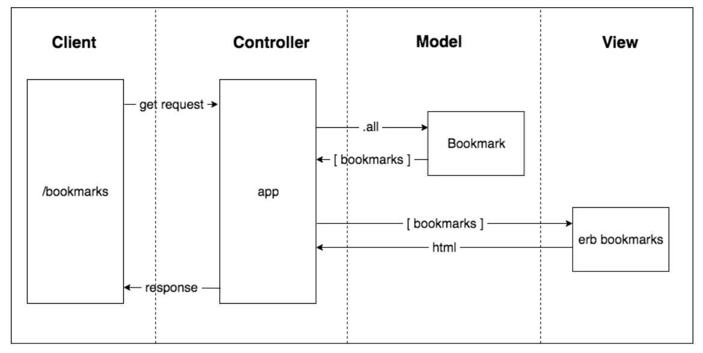

BOOKMARK MANAGER
-------

**User stories:**

`As a user,
so that I can quickly go to web sites I regularly visit, I would like to see a list of my bookmarks`

`As a time-pressed user
So that I can save a website
I would like to add the site's address and title to bookmark manager`

**Drafting initial domain model based on first user story**

-----
**Anyone needing to setup the database from scratch will need to do the following things:**

`Connect to psql
Create the database using the psql command CREATE DATABASE bookmark_manager;
Connect to the database using the pqsl command \c bookmark_manager;
Run the query I have saved in the file 01_create_bookmarks_table.sql`

-----
